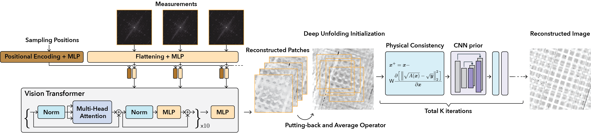

# PtychoDV (IEEE OJSP 2024)

This is the official repository of [PtychoDV: Vision Transformer-Based Deep Unrolling Network for Ptychographic Image Reconstruction](https://arxiv.org/abs/2310.07504).



## Setup the environment
We use Conda to set up a new environment by running 

```
conda env create --file "environment.yml" -n ptychodv
```

and activate this new environment

```
conda activate ptychodv
```

It is worth noting that the MKL dependency may not work properly on (old) Mac hardware.

## How to run the testing

### (1) Download the pre-trained model from the following link and put them into the folders `./pretrained_models`

[https://wustl.box.com/s/tqsxi2rb6ntmtbivf06zmppro8t5ldif](https://wustl.box.com/s/tqsxi2rb6ntmtbivf06zmppro8t5ldif)

### (2) Run the PtychoDV testing.

```
python main.py
```

The `main.py` script loads a test ground truth image and probe, simulates noisy measurements, loads the pre-trained network, and feeds the measurements and probe into the network to generate the reconstructed image. The results and ground truth images are displayed side by side using `matplotlib`. This simple script mimics the results of PtychoDV shown in Figures 4 and 5 of the main paper.

## How to run the training

The training script is not included, as the training dataset is generated using proprietary in-house software. However, the main module is implemented with PyTorch Lightning, and most training code has been retained. If you have a training dataset in the same format as our demo testing data, you should be able to run the training process seamlessly. The training code is also available upon request. For more question, please contact us at weijie.gan@wustl.edu.


## Acknowledgment

We thank John Barber for his assistance in using the LANL wave propagation code WavePro to generate the training/testing data.

## Citation

```
@article{gan2024ptychodv,
  author = {Weijie Gan and Qiuchen Zhai and Michael T. McCann and Cristina Garcia-Cardona and Ulugbek S. Kamilov and Brendt Wohlberg},
  title = {{PtychoDV}: Vision Transformer-Based Deep Unrolling Network for Ptychographic Image Reconstruction},
  year = 2024,
  month = Mar,
  journal = {IEEE Open Journal of Signal Processing},
  volume = 5,
  doi = {10.1109/OJSP.2024.3375276},
  pages = {539--547}
}
```
