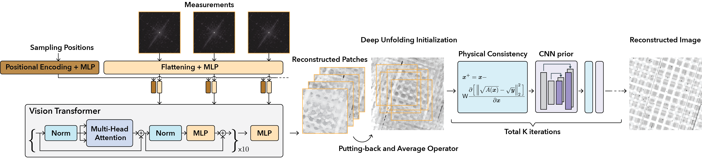

# PtychoDV (OJSP 2024)

This is the official repository of [PtychoDV: Vision Transformer-Based Deep Unrolling Network for Ptychographic Image Reconstruction](https://arxiv.org/abs/2310.07504).



## Code

We are now working on the code. Stay tuned.

## Citation

```
@article{gan2024ptychodv,
  title={PtychoDV: Vision Transformer-Based Deep Unrolling Network for Ptychographic Image Reconstruction},
  author={Gan, Weijie and Zhai, Qiuchen and McCann, Michael Thompson and Cardona, Cristina Garcia and Kamilov, Ulugbek S and Wohlberg, Brendt},
  journal={IEEE Open Journal of Signal Processing},
  year={2024},
  publisher={IEEE}
}
```
